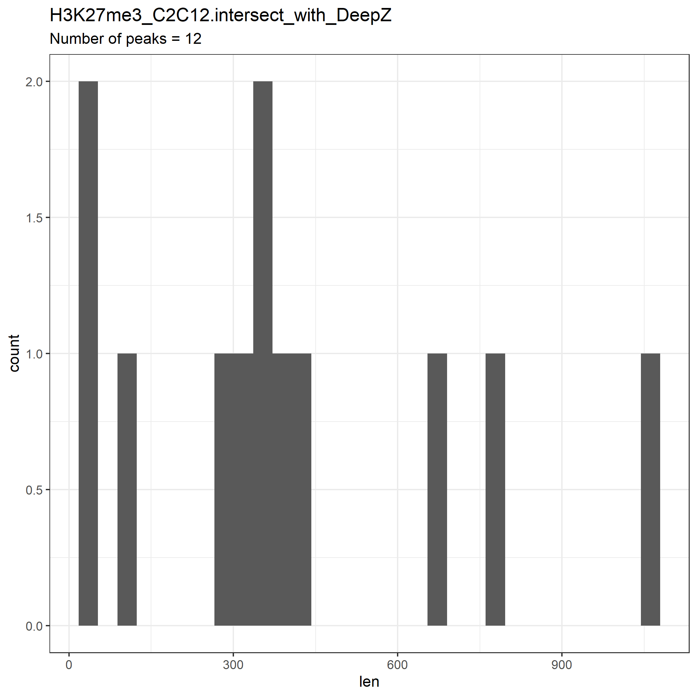

# hse21_H3K27me3_ZDNA_mouse

Repository for minor Bioinformatics

## Гистограмма длин участков 

Так как я сразу скачал нужную версию генома мыши, поэтому мне не нужно было переводить его в mm10, поэтому я построил две гистограммы

### ENCFF110HRW


### ENCFF736SSJ


## Outliers
Выкидываем последовательности длинны больше 8000

### ENCFF110HRW


### ENCFF736SSJ


## Рассмотрим расположение пиков гистоновой метки относительно аннотированных генов

### ENCFF110HRW


### ENCFF736SSJ


## Визуализирование

Объединим при помощи команды
`
cat  data/*.filtered.bed  |   sort -k1,1 -k2,2n   |   bedtools merge   >  data/H3K27me3_C2C12.merge.mm10.bed
`


## Анализ участков вторичной стр-ры ДНК

### Распределение длин участков вторичной стр-ры ДНК


### Расположение участков структуры ДНК относительно аннотированных генов


## Анализ пересечений гистоновой метки и стр-ры ДНК

Пересечем файлы
`
bedtools intersect  -a data/DNA/mouseZ-DNA1.bed -b  data/H3K27me3_C2C12.merge.mm10.bed  >  data/H3K27me3_C2C12.intersect_with_DeepZ.bed
`



### Сессия в геномном браузере

```
_ 1623184341526
addTracksButton add custom tracks
clade mammal
ct_DeepZ_9212_imgOrd 4
ct_ENCFF110HRW_3035_imgOrd 1
ct_ENCFF736SSJ_5823_imgOrd 2
ct_Intersection_4191_imgOrd 5
ct_Merged_3482_imgOrd 3
ctfile_mm10 ../trash/ct/ct_genome_13747_fd3920.bed
db mm10
encodeCcreCombined_imgOrd 10
expOrder_cons60way phyloP60wayPlacental 
hgS_loadUrlName 
hgS_otherUserName 
hgS_otherUserSessionName 
hgS_saveLocalFileCompress none
hgS_saveLocalFileName 
hgTracksConfigPage notSet
hgsid 1123534517_F1aKogRDWrmIy9zQZyzFLlEAMn3e
hgta_group user
intronEst_imgOrd 8
knownGene hide
knownGene.label.gene 1
knownGene_imgOrd 6
lastPosition chr1:3670917-3671739
lastVirtModeExtra 
lastVirtModeExtraState 
lastVirtModeType default
multiz60way_imgOrd 12
ncbiRefSeqCurated_imgOrd 7
oldPosition chr1:132130838-132132106
org Mouse
phyloP60wayPlacental_imgOrd 11
pix 1420
position chr1:132130838-132132106
position.mm10 lastVirtModeType=default&lastVirtModeExtraState=&virtModeType=default&virtMode=0&nonVirtPosition=&position=chr1%3A132130838%2D132132106
rmsk_imgOrd 14
simOrder_cons60way phyloP60wayPlacental 
snp142Common_imgOrd 13
tabulamurisBarChart_imgOrd 9
textFont Helvetica
textSize 12
textStyle Normal
trackHubs 
virtMode 0
virtModeType default
intronEst dense
tabulaMuris full
tabulamurisBarChart full
snp142Common dense
cons60way full
cpgIslandExt pack
encodeCcreCombined dense
refSeqComposite dense
rmsk dense
wgEncodeGencodeVM25 pack
altSeqLiftOverPslStrains1 dense
mm10Haplotypes pack
transMapEnsemblV5 pack
transMapRefSeqV5 pack
encode3RenChromHmm pack
cytoBandIdeo dense
crispr10KRanges dense
crispr10KTargets pack
encode3RenAtac full
defaultsSet on
```
